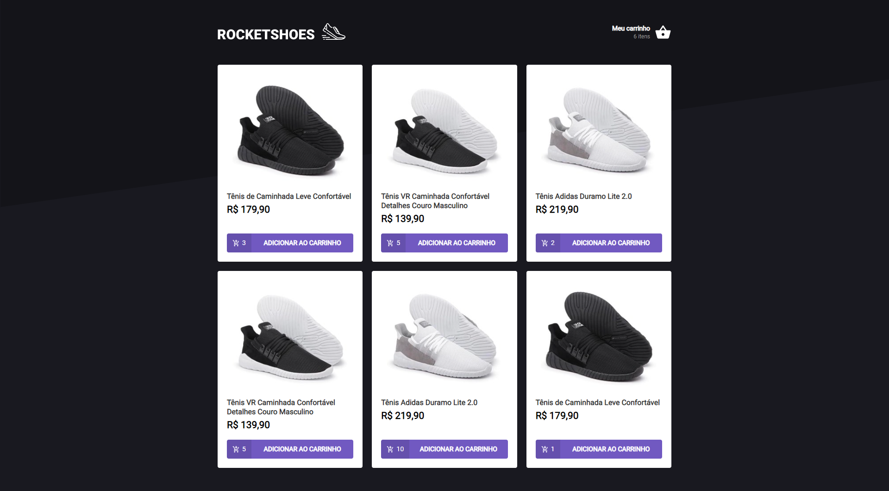

# Desafio 02 Ignite Criando um hook de carrinho de comprar | Trilha Reactjs

Desafio Chapter 02 do curso Ignite da Rocketseat | Trilha de Reactjs



<h2>Como Iniciar o projeto? 🎲 </h2>

```bash

# Clone este repositório
$ git clone https://github.com/Diego-Lopes/RocketShoes.git

# Acesse a pasta do projeto no seu terminal/cmd
$ cd RocketShoes

# Instale as dependências
$ yarn

# Inicie o servidor
$ yarn server

# Inicie o projeto
$ yarn start

```
